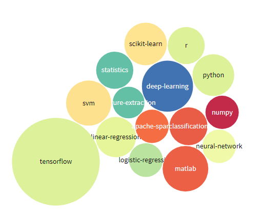
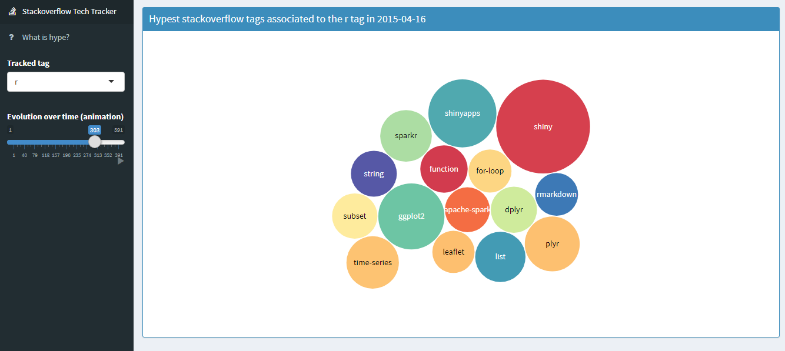

Stackoverflow Tech Tracker
================

Motivation
----------

Le monde informatique évolue très rapidement. De nouveaux frameworks, langages, librairies, packages naissent chaque jour. Certains meurent aussitôt et d'autres deviennent des incontournables. Nous nous sommes demandés s'il n'était pas possible de *sentir* ces nouvelles modes ou grands bouleversements en temps réel.

Méthode
-------

En recueillant l'ensemble des question posées sur stackoverflow entre 2009 et 2017, nous avons tracké, semaine après semaine, l'évolution des tags ayant co-occuré avec les 19 tags cibles suivants :

-   regex
-   java
-   python
-   ruby
-   javascript
-   computer-vision
-   r
-   iphone
-   objective-c
-   hadoop
-   android
-   scala
-   machine-learning
-   swift
-   apache-spark
-   neural-network
-   nlp
-   tensorflow
-   deep-learning

Métrique "Hype"
---------------

Nous avons ensuite défini une métrique dite "hype" censé mesurer la vitesse avec laquelle co-occure un tag avec un des 19 tags cible. Par exemple, le tag *"tensorflow"* commence à apparaître de plus en plus souvent avec le tag cible *"machine-learning"* en février 2016. C'est le début de la popularité de la librairie **tensorflow** dans le domaine du machine learning.

Application Shiny
-----------------

L'application Shiny <https://snak.shinyapps.io/sovtracker/> permet de suivre l'évolution des tags les plus *hype* entre 2009 et 2017 autour des 19 tags cibles.

